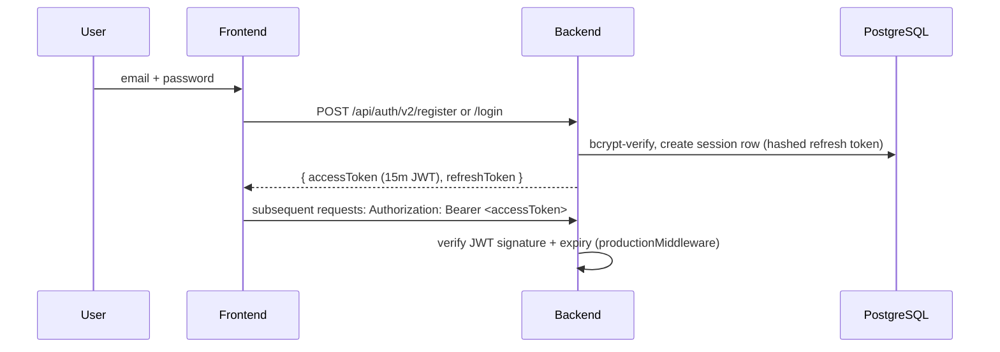
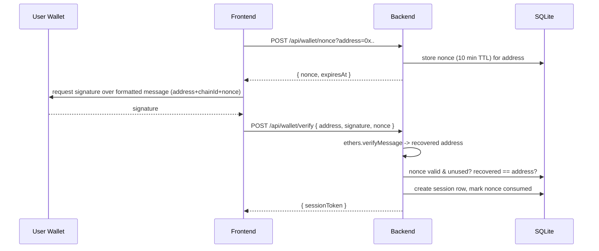
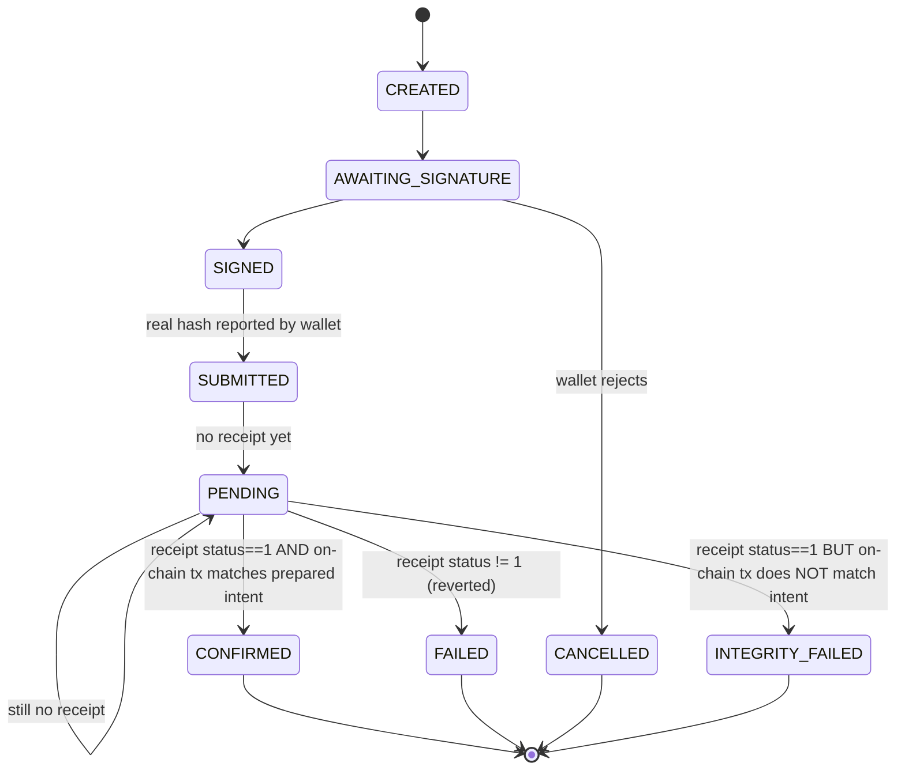
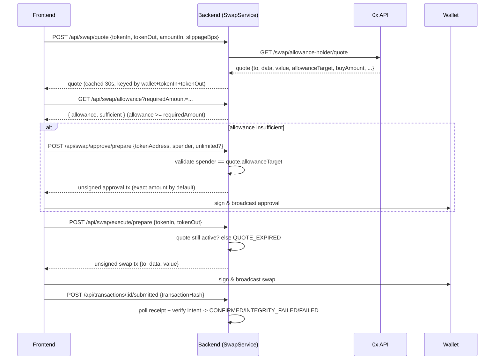

# Hypercross Architecture

## System overview

```mermaid
flowchart LR
    subgraph Client["Browser / Electron Desktop"]
        UI[React UI]
        Wallet[Wallet Extension\n(wagmi / RainbowKit)]
    end

    subgraph Backend["Express Server (server.ts)"]
        Auth[Auth\n(legacy SQLite + JWT/Postgres)]
        WalletVerify[Wallet Verification]
        Portfolio[Portfolio Service]
        Transfer[Transfer Service]
        Swap[Swap Service]
        TxSvc[Transaction Service\n(state machine + intent verification)]
        Billing[Billing / Entitlements]
        Chain[Blockchain Service]
    end

    subgraph External["External services"]
        Chainstack[(Chainstack RPC/WSS)]
        ZeroEx[(0x Swap API)]
        Stripe[(Stripe)]
        PG[(PostgreSQL)]
        SQLite[(SQLite - local app state)]
    end

    UI -->|REST/JSON| Auth
    UI -->|REST/JSON| WalletVerify
    UI -->|REST/JSON| Portfolio
    UI -->|REST/JSON| Transfer
    UI -->|REST/JSON| Swap
    UI -->|REST/JSON| TxSvc
    UI -->|REST/JSON| Billing
    Wallet -.->|signs & broadcasts| Chainstack

    WalletVerify --> SQLite
    Auth --> SQLite
    Auth --> PG
    Billing --> PG
    Billing --> Stripe
    TxSvc --> SQLite
    Portfolio --> Chain
    Transfer --> Chain
    Swap --> Chain
    Swap --> ZeroEx
    Chain --> Chainstack
```

## Trust boundaries

1. **Browser/wallet ↔ Backend** — untrusted. The client never supplies authoritative user id,
   wallet ownership, subscription status, entitlement, token decimals, chain id, or transaction
   confirmation state. All of these are independently derived/verified server-side.
2. **Backend ↔ Chainstack** — trusted infrastructure boundary; Chainstack is the sole blockchain
   data source (no public RPC fallback). Read results (balances, receipts, transaction bodies) are
   treated as authoritative for confirming state, but responses are still shape-validated.
3. **Backend ↔ 0x API** — semi-trusted third party; response fields (`to`, `data`, `allowanceTarget`)
   are relayed to the wallet for signing but the approval spender is cross-checked against the
   active quote before use (see Threat Model #5).
4. **Backend ↔ Stripe** — trusted via signed webhooks only; the backend never trusts client-supplied
   billing state.
5. **Backend ↔ Database(s)** — Postgres (Drizzle) is authoritative for commercial identity/billing;
   local SQLite is authoritative for wallet verification, transaction lifecycle, and legacy identity.

## Authentication (dual model — see MVP_READINESS_REPORT.md for unification status)



The legacy SQLite cookie-session system (`server/auth.ts`, `/api/auth/*`) remains for
organization/role-based legacy routes and wallet-session bootstrapping. Per this pass's
requirement (#7 in the hardening spec), production financial routes (`transfers`, `swap`,
`transactions`) currently authorize via `requireAuth` (legacy session) using
`req.user.walletAddress`; full unification onto a single identity model spanning
account → session → verified wallet → subscription → entitlement is **PARTIAL** — see the
readiness report for what remains.

## Wallet verification flow



## Transaction lifecycle & intent verification



Every transition is server-driven (`server/transactions/TransactionService.ts`); the client only
sends *events* (submitted hash, cancelled), never a target state directly. See
`server/transactions/TransactionIntegrity.ts` for the intent-comparison logic and
`docs/THREAT_MODEL.md` #2 for the adversarial scenario this defends against.

## 0x swap flow



## Data flow: portfolio

Portfolio balances are read live from Chainstack (`BlockchainService.readContract` /
`getBalance`) per request/refresh; `userHoldings` in SQLite is a cache, not a source of truth.
Raw balances are always kept as base-unit strings; `balanceDecimal` is a display-only float
derived via `ethers.formatUnits`/`formatEther` (never used for authoritative comparisons).
