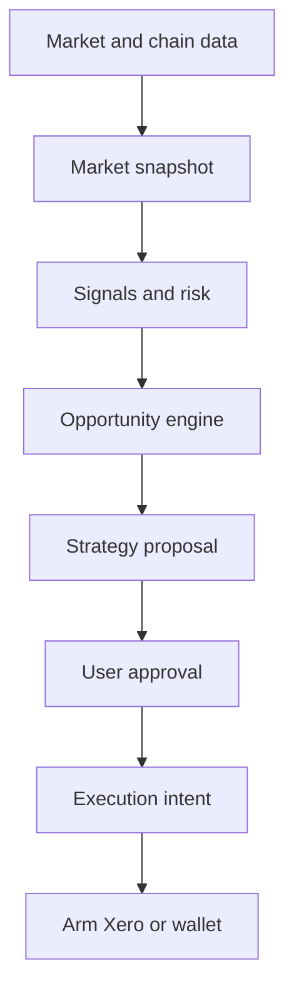

# Hypercross Nexus Architecture

Nexus is the strategic analysis layer. It does not autonomously execute trades.

## Boundaries

- **Nexus thinks:** normalizes observed data, calculates explainable signals, evaluates risk, and proposes actions.
- **The user approves:** every proposal and execution intent carries a mandatory approval flag.
- **Xero acts:** a future constrained execution layer may consume an intent after wallet, entitlement, network, and policy checks.

The initial engine is deterministic. Missing, stale, or unproven data remains unknown or blocks the opportunity; it is never replaced with fabricated market values.

## API

When PostgreSQL authentication is configured, `/api/intelligence/analyze` and `/api/intelligence/proposals` require the canonical production identity and `advanced_strategies` entitlement. Market, signal, opportunity, and risk paths return an explicit not-configured response until a live market provider is connected.